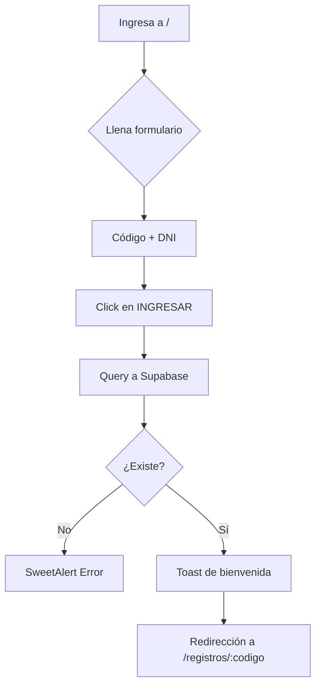
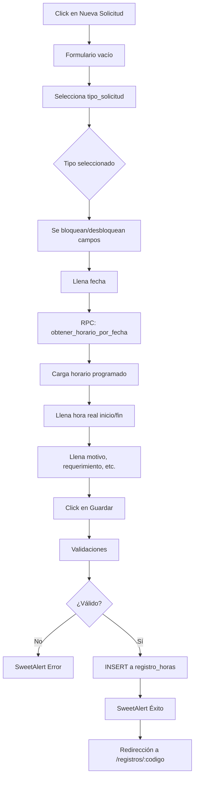
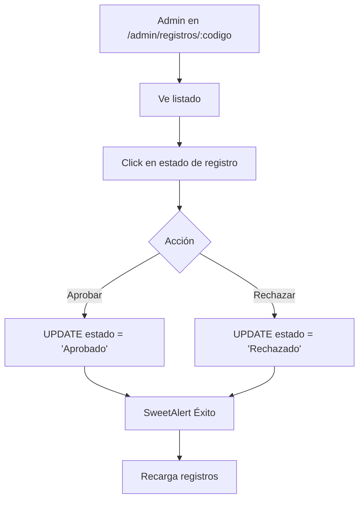
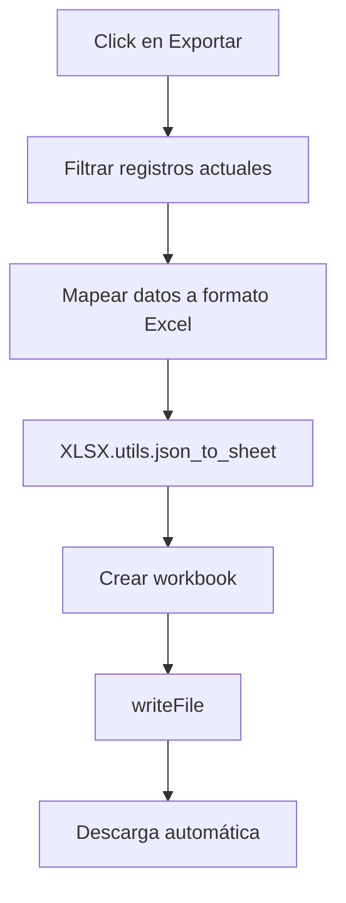

# MMLS - Modelos, Flujos y Arquitectura

Este documento describe los **modelos de datos**, **flujos de trabajo** y **arquitectura técnica** del Portal de Compensaciones.

---

## 🗄️ Modelos de Datos

### Tabla: `personal`

Almacena información de empleados de CIPSA.

```typescript
interface Personal {
  id: number               // PK, auto-incremental
  codigo: string           // Código único de trabajador (ej: "01001234")
  dni: string              // DNI del trabajador (usado como contraseña)
  nombres: string          // Nombres completos
  apellidos: string        // Apellidos completos
  cargo: string            // Puesto de trabajo
  seccion: string          // Sección o departamento
  foto: string             // Nombre del archivo de foto en Storage
  created_at: timestamp    // Fecha de creación
}
```

**Índices:**
- PK: `id`
- Unique: `codigo`
- Index: `codigo`, `dni` (para login rápido)

---

### Tabla: `registro_horas`

Almacena solicitudes de compensación de horas.

```typescript
interface RegistroHoras {
  id: number                      // PK, auto-incremental
  nro_registro: string            // Número único de registro (generado)
  codigo_trabajador: string       // FK a personal.codigo
  tipo_solicitud: string          // Ver enum TipoSolicitud
  estado: string                  // "Pendiente" | "Aprobado" | "Rechazado"
  fecha_hora_inicio: timestamp    // Datetime de inicio real
  fecha_hora_fin: timestamp       // Datetime de fin real
  lugar_trabajo: string           // "CIPSA" | "Cliente" | "N/A"
  motivo: string                  // Descripción del motivo
  requerimiento: string           // Requerimiento asociado
  tipo_de_marcacion: string       // Tipo de marcación
  created_at: timestamp           // Fecha de creación del registro
  updated_at: timestamp           // Última actualización
}
```

**Enum: TipoSolicitud**
1. `"COMPENSACIÓN POR TRASLADO DE VIAJE"`
2. `"COMPENSACIÓN A FAVOR DE CIPSA"`
3. `"POR SALIDAS ANTES DE HORARIO"`
4. `"SOBRETIEMPO EN CLIENTE"`
5. `"SOBRETIEMPO EN CIPSA"`

**Relaciones:**
- `codigo_trabajador` → `personal.codigo` (FK)

**Índices:**
- PK: `id`
- Unique: `nro_registro`
- Index: `codigo_trabajador`, `estado`, `fecha_hora_inicio`

---

### Storage: `fotos personal`

Bucket público de Supabase para almacenar fotos de perfil.

**Estructura:**
```
fotos personal/
  ├── 01001234.jpg
  ├── 01001235.png
  └── ...
```

**URL de acceso:**
```
https://pwzogtzcgcxiondlcfeo.supabase.co/storage/v1/object/public/fotos%20personal/{codigo}.{ext}
```

---

### RPC: `obtener_horario_por_fecha`

Función PostgreSQL que consulta el horario programado de un empleado en una fecha específica.

**Parámetros:**
```sql
p_codigo: text      -- Código del trabajador
p_fecha: date       -- Fecha a consultar
```

**Retorno:**
```typescript
{
  hora_inicio: string   // HH:MM formato 24h
  hora_fin: string      // HH:MM formato 24h
}
```

---

## 🔄 Flujos de Trabajo

### Flujo 1: Login de Empleado



---

### Flujo 2: Crear Nueva Solicitud



---

### Flujo 3: Aprobar/Rechazar Solicitud (Admin)



---

### Flujo 4: Exportar a Excel



---

## 🏗️ Arquitectura Técnica

### Stack Tecnológico

```
┌─────────────────────────────────────┐
│         FRONTEND (SPA)              │
│  React 19.2 + Vite 7.2.4            │
│  React Router DOM 7.12.0            │
│  SweetAlert2, XLSX                  │
└─────────────┬───────────────────────┘
              │
              │ HTTPS REST API
              │
┌─────────────▼───────────────────────┐
│      BACKEND (BaaS)                 │
│     Supabase                        │
│  ┌──────────────────────────────┐   │
│  │  PostgreSQL Database         │   │
│  │  - personal                  │   │
│  │  - registro_horas            │   │
│  └──────────────────────────────┘   │
│  ┌──────────────────────────────┐   │
│  │  Storage (S3-like)           │   │
│  │  - fotos personal (bucket)   │   │
│  └──────────────────────────────┘   │
│  ┌──────────────────────────────┐   │
│  │  Functions (PostgreSQL RPC)  │   │
│  │  - obtener_horario_por_fecha │   │
│  └──────────────────────────────┘   │
└─────────────────────────────────────┘
```

---

### Arquitectura de Componentes React

```
main.jsx (Entry Point + Router)
│
├── App.jsx (Login Empleados)
│
├── UserRecords.jsx (Vista Empleado)
│   └── NewRequest.jsx (Crear/Editar)
│
├── AdminLogin.jsx (Login Admin)
│
└── AdminDashboard.jsx (Panel Admin)
    └── AdminUserRecords.jsx (Gestión Registros)
```

**Componentes compartidos:**
- Ninguno actualmente (cada componente es standalone)

**Estado global:**
- No utiliza context/redux
- Estado local por componente (useState)
- Navegación vía `useNavigate`
- Parámetros vía `useParams`

---

### Flujo de Datos

#### Lectura (Query)

```
Component
  └─> useEffect
       └─> supabase.from('tabla').select()
            └─> PostgreSQL
                 └─> Response
                      └─> setState
                           └─> Re-render
```

#### Escritura (Mutation)

```
Form Submit
  └─> handleSubmit
       └─> Validaciones
            └─> supabase.from('tabla').insert/update()
                 └─> PostgreSQL
                      └─> SweetAlert (Toast/Modal)
                           └─> navigate() o fetchData()
```

---

### Despliegue

#### Opción A: Contenedor LXC (Proxmox)

```
┌────────────────────────────────────┐
│  LXC Container (Debian)            │
│  ┌──────────────────────────────┐  │
│  │  Nginx (Reverse Proxy)       │  │
│  │  - Serve static files        │  │
│  │  - Gzip compression          │  │
│  │  - Security headers          │  │
│  └──────────┬───────────────────┘  │
│             │                       │
│  ┌──────────▼───────────────────┐  │
│  │  /var/www/compensaciones/    │  │
│  │  dist/                       │  │
│  │  - index.html                │  │
│  │  - assets/                   │  │
│  └──────────────────────────────┘  │
│                                    │
│  UFW Firewall                      │
│  - Allow 80/443                    │
└────────────────────────────────────┘
```

**Automatización:**
- Script `deploy.sh` para instalación completa
- Script `/root/update-compensaciones.sh` para actualizaciones

---

#### Opción B: Cloudflare Pages

```
GitHub Repo
  └─> Push to main
       └─> Cloudflare Pages Webhook
            └─> Build: npm run build
                 └─> Deploy dist/ to CDN
                      └─> URL: https://tu-app.pages.dev
```

---

### Optimizaciones

#### Frontend
- Vite con HMR para desarrollo rápido
- Tree-shaking en producción
- Code splitting automático (React Router)
- Lazy loading de componentes (no implementado aún)

#### Backend (Supabase)
- Row Level Security (RLS) - No configurado actualmente
- Índices en columnas frecuentemente consultadas
- Connection pooling automático

#### Nginx
- Gzip compression para assets
- Cache headers para JS/CSS (1 year)
- No-cache para index.html
- Minificación vía Vite build

---

### Seguridad

#### Autenticación
- **Empleados:** Código + DNI (query directo a BDD)
- **Admin:** Hardcoded (no recomendado para producción)

⚠️ **Mejoras pendientes:**
- Migrar admin a Supabase Auth
- Implementar JWT para sesiones
- Row Level Security (RLS) en Supabase
- Rate limiting en login

#### Autorización
- Rutas protegidas mediante navegación
- Sin validación en backend (confía en frontend)

⚠️ **Mejoras pendientes:**
- Middleware de validación en RPC
- Políticas RLS por rol
- Auditoría de cambios

---

## 📈 Escalabilidad

### Limitaciones Actuales
- Sin paginación (carga todos los registros de un empleado)
- Sin virtualización en listas largas
- Sin caché de queries repetidas
- Sin lazy loading de componentes

### Mejoras Propuestas
- Implementar paginación infinita
- React Query para caché y refetch
- Virtualización con react-window
- Code splitting por ruta
- CDN para assets estáticos

---

**Última actualización:** Febrero 18, 2026

**Nota:** Este archivo fue renombrado de `mmls.md` a `architecture.md` para seguir nomenclatura estándar de la industria.
